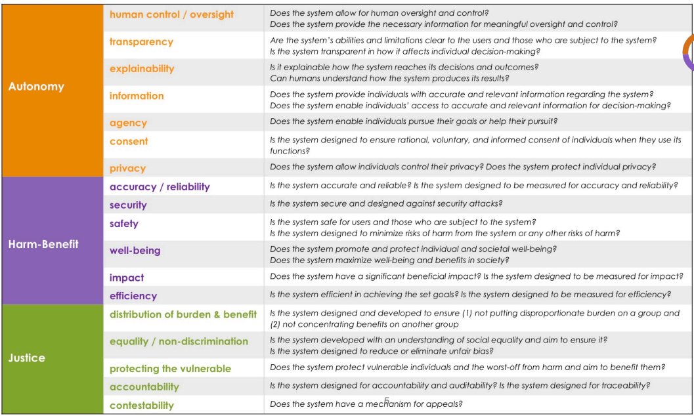

# responsible-datascience-ws
A workshop to learn how to work with ML responsibly.

## Steps to run for the Setup

Preferably, you have run these steps before our workshop. This will save us some time.

1. Install [miniconda](https://docs.conda.io/en/latest/miniconda.html) in your operative system. Of course, if you have conda from before, that is fine. Miniconda is a lighter distribution with less baggage. Make sure you initialize conda for the shell you typically use by running `conda init` in it. 
2. To create the environment run: `make venv`. Beware: this wil also run `conda update -n base -c defaults conda` to update your environment to the latest version (currently `4.14.0`). The command will also install all the environments used for this workshop. If this command fails for any reason, you can still create the environments manually by running `conda env update -f <environment>.yaml`. To clean up your conda environments, you can run `make remove-venv`, when the workshop is done.
3. Then activate the environment `conda activate ml_workshop`
4. Run `make jupyter` to start jupyter lab and open the [ML_intro.ipynb]() notebook. If you came this far, your environment is ready.

## Environments to use during this workshop

We will use several conda environments for different notebooks:

- [ml_workshop](ml_wokshop.yaml): This is the main environmnent for the workshop. Used to run notebooks within [reproducible-ml](), [misc]().
- [ml_eda](ml_eda.yaml): Used to run notebooks under [eda]().
- [ml_data_validation](ml_data_validation.yaml): Used to run notebooks under [data_validation]().
- [ml_automl](ml_automl.yaml): Used to run notebooks under [auto-ml]().

Please make sure you activate the correct environment before runing the notebooks. This is done from the command line by runing `conda activate <environment>`, and then `make jupyter`. 

Now there is a way to make things easier for you. You can run `source ./install_kernels.sh`. If this command succeeds, it will install the conda environments for you in jupyter. Then you will be able to select the correct kernel from the jupyter lab, without having to restart jupyter or having to run several instances in parallel.

## Running the Workshop

Here is how we planned you should run this workshop. You will get to know several tools (pandas profiling, predictive power score, tensorflow data validation, mljar auto-ml, ...) that will help you in the process. **It is not our intention to recommend these tools for you to use, but more as an example of the processes and the way of thinking that you should have.** Always be careful when adopting new tools. These tend to make assumptions and choices for you, so you need to carefully read the documentation and see if you are happy with those choices. If you are not careful enough, you may be mislead by the results of those.

### Quick and dirty

Start with the notebook in [ML_intro.ipynb]() (in the `ml_workshop` environment). Think about the following questions after you ran through the code:

- Who is the author of this notebook?
- What is the purpose of the notebook? What did the author tried to achieve?
- How about the code quality? Are you bothered by the repeated chunks of code? Did you spot any typos?
- What can you improve about this notebook?
- If you re-run the notebook several times, would you get the same results? 
- What version of the imported packages did the author use? Do you know what git branch the author was working on while running the notebook? Can you track back to the version of the repo when this notebook was last run?

As you can see, there are several serious issues with code quality, transparency and reproducibility. Unfortunately, you will find lots of notebooks like this. So let's change that.

### A better approach

You will notice that this repository contains several files. Let's go through some of these:

- [Makefile](). Makefiles help you automate repetitive tasks. It also lowers the bar for people setting up the environment or onboarding new peers into your project. Have a look at the file, and see if you understand what the commands do. Then in your shell run `make` to get a help menu letting you know what you can do with it. If you want to know more about makefiles, have a look at this 10 min minicourse from [calmcode.io](https://calmcode.io/makefiles/the-problem.html)

- Environment `yaml` files. We are using conda for this workshop. Personally I'm not happy with conda, since it is very bloated (you will use only a small percentage of what you install), and when building production pipelines, you end up with very large docker images. Also the environment management is ... meehh... But it is easy to use, and it is a good starting point. Open the files and look at the structure. You will see that the main libraries are pinned to their exact version. Here I use a standard in which "environment stuff" is installed via conda, but libraries we use are installed via "pip". In the case you want to change your environment manager, you can easily move your pip dependencies with you. You will also notice the separation of environments. This is for modularity in the ML pipeline. In case you want to extract the EDA part from the modeling part, this will be easy. 

- Writting good jupyter notebooks is an art. Look at the template in [reproducible-ml/template_notebook.ipynb](). Next time you start a notebook, make a copy of this notebook and start from there. It will automatically format your code and watermark your environment (package versions, git branch, git hash, ...). 

- Move repetitive code to python functions. Have a look at [reproducible-ml/clean_modeling.ipynb]() for an example of this. You will notice the [pyproject.toml]() and the files under [src/workshop]. This is code you can reuse in your notebooks, and the packages are already available in you conda environment. If you are developing this package, make sure then to install this project in edit mode (`pip install -e .`) so that changes in your code there will be availabe in your environment. You will also need to add the [autoreload](https://ipython.org/ipython-doc/3/config/extensions/autoreload.html) extension to your notebook, to use your new changes without restarting the whole kernel.

- Fix your `RANDOM_SEED`. In the rest of the notebooks, we show you how to use this feature. Then your results will be more reproducible.

### Data centric AI

>Data-Centric AI (DCAI) represents the recent transition from focusing on modeling to the underlying data used to train and evaluate models.
>Andrew Ng

We are moving away from focusing on model improvements to focusing on improving the data. Typically, model improvements give you single digit performance increase, while improving the data can give you double digits! For example, in https://https-deeplearning-ai.github.io/data-centric-comp/ the best team got a 21% improvement by working on the data.

Start by understanding the data you are working on. So far you have just executed the notebooks that care about the model improvements. But do you understand what the data means? 

Run the notebook [eda/eda_profiler.ipynb]() (by using the `ml_eda` environment) and think about the following:

- Do you have a better understanding of the data now?
- Do you trust this data to solve the problem? 
- Given that the data comes from a questionaire, think about the questions and the answers. Would you have answered those questions the same way one week later? Do you know what population is being represented?

Now run [data_validation/split_analysis.ipynb]() (by using the `ml_data_validation` environment). Here is an example of a tool that can help you analyze your data splits, to make sure the data distributions are similar.

### AutoML

Can we automate all these processes? Yes we can! Look at the [auto-ml/auto-ml.ipynb]() notebook (by using the `ml_automl` environment), and see how we can benefit from AutoML.  

You can use AutoML as a technique to help you measure how “challenging” a problem/dataset is, which types of models work well for the task, and help decide which algorithm to choose.

BUT: Never use this technique as an end to end solution. Make sure you continue the model development after using it. Always understand the choices made for you by the tools you use!

## Closing discussions

So what do we mean by responsible ML development? Well, it is a process to develop ML applications while at the same time making sure it:

1. Respects **autonomy**
2. Avoids **harm** and does **good**
3. Ensures **justice**

These are the core values, as defined by [Cansu Canca](http://aiethicslab.com/wp-content/uploads/2020/08/Canca_AI-Principles_ACM.pdf). They in turn translate to instrumental principles like: 

[source](https://aiethicslab.com/wp-content/uploads/2020/08/The-Box_Manual_v.2.pdf)

In this workshop we have touched a bit upon:

- Autonomy: In the areas of transparency, information
- Harm-benefit: In the areas of accuracy / reliability, efficiency
- Justice: In the areas of accountability

But as you can see, we have several untouched areas which we didn't cover.

## Recommended follow up

If you are curious, and want to learn more, we recommend you the following links:

1. [Uncertainty quantification of model predictions](https://github.com/scikit-learn-contrib/MAPIE). This technique will help you quantify the uncertainty of your model predictions.
2. [Explore model errors](https://github.com/microsoft/responsible-ai-toolbox). This tool will help you find the slices of your data where your model fails the most. But it also has several other functionalities.
3. Model calibration: [Machine learning mastery](https://machinelearningmastery.com/calibrated-classification-model-in-scikit-learn/) [Towards data science](https://towardsdatascience.com/pythons-predict-proba-doesn-t-actually-predict-probabilities-and-how-to-fix-it-f582c21d63fc). Your model scores are not (usually) probabilites. The problem is that when setting thresholds to discern a class, the scores of your next model may not have nothing to do with the ones of your previous one. If you calibrate your model, then you don't have to change the thresholds. At the same time, the threshold is interpretable as the probability you want to commit to.
4. Model serialization (how to save your model
[sklearn-onnx](https://onnx.ai/sklearn-onnx/index.html). (DO NOT USE joblib!)
5. [Data version control](www.dvc.org). Don't you just version control your code, but also your data. Integrates with git.
6. MLOps - operationalizing a model https://madewithml.com/. Well anything you can learn from that site is fantastic. 
7. [Finding errors in your labelled data](https://github.com/cleanlab/cleanlab)
8. [How green are your computations?](https://green-algorithms.org/). Recommended by a workshop participant. Thanks!
